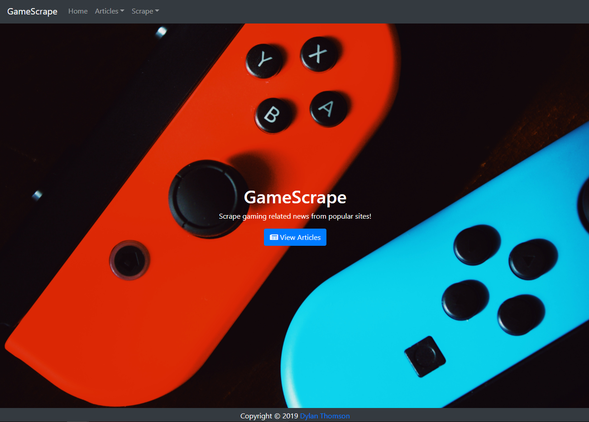
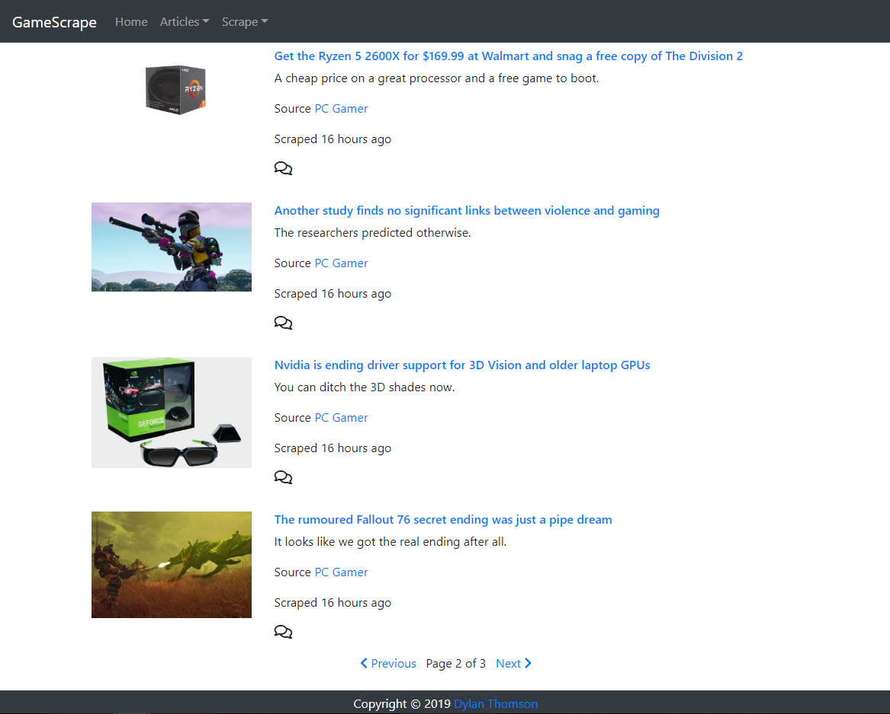

# GameScrape

## Scrape Gaming News

[Live Site](https://gamescrape.herokuapp.com/)

GameScrape is a full stack web application where users can scrape news articles from gaming websites. It uses [axios](https://www.npmjs.com/package/axios) and [cheerio](https://www.npmjs.com/package/cheerio) to get HTML pages and extract data from them, including the article title, link, image, and summary. The data is saved to a [Mongo](https://www.mongodb.com/) database using [Mongoose](https://www.npmjs.com/package/mongoose), and avoids adding duplicate articles by ensuring that the article url is a unique value. 

Users can view scraped articles and click links to both the article itself and the home page of the source. They are also able to view, add, and delete comments to each article. I implemented pagination when viewing articles, so that at most 10 articles are display per page.

## Packages used: 
* [Express](https://www.npmjs.com/package/express) - Web Server
* [Mongoose](https://www.npmjs.com/package/mongoose) - Object modeling
* [Express-Handlebars](https://www.npmjs.com/package/express-handlebars) - Generating HTML templates
* [Axios](https://www.npmjs.com/package/axios) - Make HTTP requests
* [Cheerio](https://www.npmjs.com/package/cheerio) - Serverside DOM traversal, based on jQuery
* [dotenv](https://www.npmjs.com/package/dotenv) - Create an environment variable for hiding sensitive data
* [Morgan](https://www.npmjs.com/package/morgan) - Logger
* [ESLint](https://www.npmjs.com/package/eslint) - Linter (AirBNB Standard)

## Libraries/Frameworks used:
* [Bootstrap](https://getbootstrap.com/) - CSS and Modals
* [jQuery](https://jquery.com/) - DOM manipulation and AJAX
* [Font Awesome](https://fontawesome.com/) - Icons

## Challenges
The main challenges involved scraping the desired data from third party websites. I decided to scrape three different websites, and each of them involved a different process and different challenges. Using Chrome's inspect tool, I was able to learn a lot about each site's structure which helped with DOM traversal. 

When scraping images from two of the sites, I would sometimes get placeholder images despite being able to see the actual images in my browser. Luckily, these image tags had stored the image link in a data-attribute, and I was able to get the image source from that, rather than from the src attribute. It would seem that these pages are using a script to load the image link into src rather than hardcoding it in. 

One of the websites I was scraping was happily giving me its data when running the application on my local server, but would return a 403 (forbidden) error code when deployed on Heroku. I tried explicitly passing config/header data with my axios request, which worked initially, but resumed returning 403 codes minutes later. At this point I'm leaning towards the idea that this particular site is blocking these sort of requests in order to avoid being scraped. For the time being, only two of the three original sites are available for scraping. I'm considering asking this site for permission to scrape their data, as I feel there's a good chance they would be okay with the way I'm doing it (visible links to their article and site).

## Potential Changes
* User auth - This was in my initial plan but I had to scale back in order to meet the requirements for this assignment first. I would tie comments to user accounts, let users save favorite articles, and implement a "likes" system. I also had the idea of creating an admin account that could delete any comment or article, as well as other powers.
* Scrape more websites and get permission from sites that seem to be blocking this application

## How To Clone
* Open terminal to directory you wish to clone into and run `git clone https://github.com/Dylan-Thomson/GameScrape.git`
* Install modules by running `npm install`
* Install [MongoDB](https://docs.mongodb.com/manual/installation/) and run the server.
* Add a `SESSION_SECRET` to your .env file.
* Run the application by entering `node server.js` into your terminal
* Open browser and type `localhost:3000` (or whatever port number you are using)
